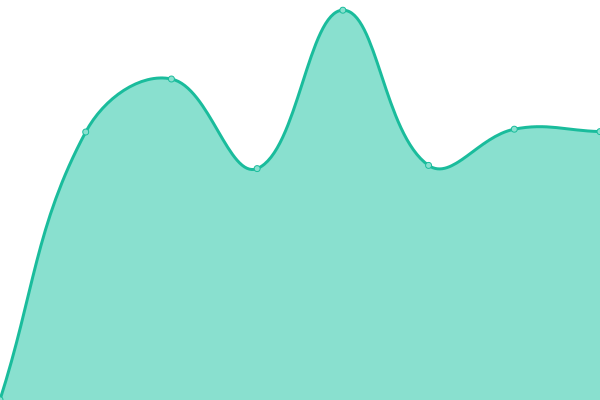
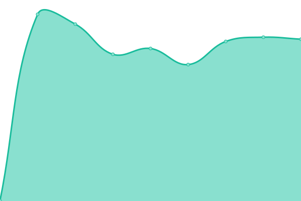

# [📈 Live Status](https://Juanpacervin.github.io/waikipruebas): <!--live status--> **🟧 Partial outage**

This repository contains the open-source uptime monitor and status page for [Juanpacervin](https://Juanpacervin.github.io/waikipruebas), powered by [Upptime](https://github.com/upptime/upptime).

With [Upptime](https://upptime.js.org), you can get your own unlimited and free uptime monitor and status page, powered entirely by a GitHub repository. We use [Issues](https://github.com/Juanpacervin/waikipruebas/issues) as incident reports, [Actions](https://github.com/Juanpacervin/waikipruebas/actions) as uptime monitors, and [Pages](https://Juanpacervin.github.io/waikipruebas) for the status page.

<!--start: status pages-->
<!-- This summary is generated by Upptime (https://github.com/upptime/upptime) -->
<!-- Do not edit this manually, your changes will be overwritten -->
<!-- prettier-ignore -->
| URL | Status | History | Response Time | Uptime |
| --- | ------ | ------- | ------------- | ------ |
|  [Casa Solari](http://144.217.5.19:27938/) | 🟥 Down | [casa-solari.yml](https://github.com/waikiservicios/upptimewaiki/commits/HEAD/history/casa-solari.yml) | 

 0ms
     
 | 

<a href="https://waikiservicios.github.io/upptimewaiki/history/casa-solari">5.44%</a>
    

|  [Odoo Pruebas I](http://odoopruebas.ddns.net/) | 🟥 Down | [odoo-pruebas-i.yml](https://github.com/waikiservicios/upptimewaiki/commits/HEAD/history/odoo-pruebas-i.yml) | 

 425ms
     
 | 

<a href="https://waikiservicios.github.io/upptimewaiki/history/odoo-pruebas-i">0.00%</a>
    

|  [Santa Teresa](http://santateresa.ddns.net:37234/) | 🟩 Up | [santa-teresa.yml](https://github.com/waikiservicios/upptimewaiki/commits/HEAD/history/santa-teresa.yml) | 

 1955ms
     
 | 

<a href="https://waikiservicios.github.io/upptimewaiki/history/santa-teresa">76.24%</a>
    

|  [Waikiddns](http://waikiservicios.ddns.net/) | 🟩 Up | [waikiddns.yml](https://github.com/waikiservicios/upptimewaiki/commits/HEAD/history/waikiddns.yml) | 

 3158ms
     
 | 

<a href="https://waikiservicios.github.io/upptimewaiki/history/waikiddns">99.63%</a>
    

<!--end: status pages-->

[**Visit our status website →**](https://Juanpacervin.github.io/waikipruebas)

## 📄 License

- Powered by: [Upptime](https://github.com/upptime/upptime)
- Code: [MIT](./LICENSE) © [Juanpacervin](https://Juanpacervin.github.io/waikipruebas)
- Data in the `./history` directory: [Open Database License](https://opendatacommons.org/licenses/odbl/1-0/)
